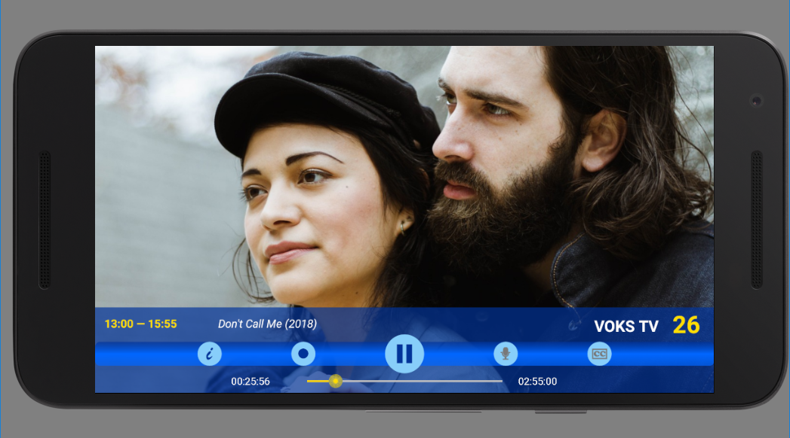

# Welcome Developers and Content Owners!

This GitHub page contains all the information you need for creating and managing your own TiviApp Content Provider. 
Here you will find:
- An introduction to the Content Provider concept
- A quick guide on how to get started with developing your own Content Provider
- "Hello World" projects overview
- A guide on how to upload your working Provider to our main repository
 
 If you are still not fimiliar with the TiviApp application, please visit our [website](http://tiviapplive.com).
 
## Introduction
 
 A Content Provider is basically a third-party piece of code (sometimes called "plugin" or "addon") that provides usefull content for TiviApp users. This content can be either:
 - One or more playlists (**Channel Lists**) in M3U format
 - One or more EPG (**TV Guides**) in XMLTV format
 - A specific stream (**Channel**) in one of the supported formats 

 
 There are two types of Providers that are currently supported by TiviApp:
 - **Android Provider**: A Provider that comes in a form of an Android application. This kind of provider is demonstrated by the ["HelloWorld"](HelloWorld) Android project in this repository
 - **Web Provider**: A Provider that comes in a form of a web application (can be either client-side such as .html/.js files or a server side such as .php/.aspx). This kind of provider is demonstrated by the ["HelloWorldWeb"](HelloWorldWeb) web project.
 
 Each Provider is basically a small server that handles various requests from the TiviApp client. Therefore your code should be designed according to the following basic principles:
 1. **Efficiency**. Upon receiving a request from the client, the server should retrieve a response as quickly as possible. If your code is unbale to return a response to the client within a reasonable amount of time - a timeout will be invoked and your information will be ignored by TiviApp.
 2. **Memoryless**. Your code should respond only to the given request. There is no need to store or rely on data from previous requests as it most likely irrelevant.
 3. **Responsive**. You should respond to any request from the server, even if an error has been found during the execution of your logic. TiviApp Provider Platform has APIs for reporting errors to the client. Some of them will be displayed to the user.
 4. **Compact** (for Android Provider). Avoid allocating memory on the heap and free it all upon receiving the ```onDestroy``` event.
 
 The simpliest way of getting started is to clone this repository and start exploring the demo projects. 
 
 

## Getting Started

 
 Each Content Provider is hosted on a repository (server for example), which is described by a special JSON file. TiviApp has one official such repository embedded within the main application. If your Provider is not hosted there, the user should explicitly add your repository by providing the path to the corresponding JSON.
## Welcome to GitHub Pages

You can use the [editor on GitHub](https://github.com/montezumba/TiviAppDev/edit/master/README.md) to maintain and preview the content for your website in Markdown files.

Whenever you commit to this repository, GitHub Pages will run [Jekyll](https://jekyllrb.com/) to rebuild the pages in your site, from the content in your Markdown files.

### Markdown

Markdown is a lightweight and easy-to-use syntax for styling your writing. It includes conventions for

```markdown
Syntax highlighted code block

# Header 1
## Header 2
### Header 3

- Bulleted
- List

1. Numbered
2. List

**Bold** and _Italic_ and `Code` text

[Link](url) and 
```

For more details see [GitHub Flavored Markdown](https://guides.github.com/features/mastering-markdown/).

### Jekyll Themes

Your Pages site will use the layout and styles from the Jekyll theme you have selected in your [repository settings](https://github.com/montezumba/TiviAppDev/settings). The name of this theme is saved in the Jekyll `_config.yml` configuration file.

### Support or Contact

Having trouble with Pages? Check out our [documentation](https://help.github.com/categories/github-pages-basics/) or [contact support](https://github.com/contact) and we’ll help you sort it out.
